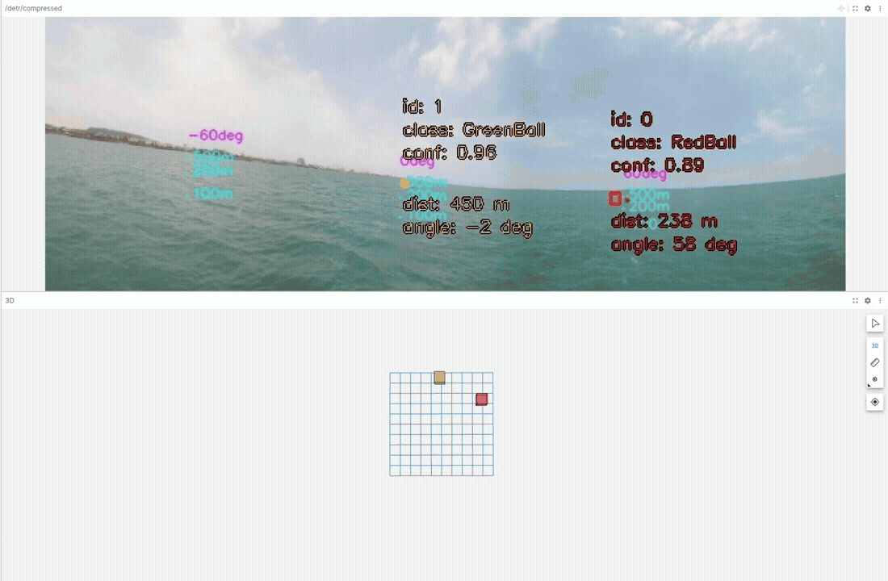

# HuggingFace DETR

HuggingFace DETR Training, Evaluation, Inferencing Guide

## Clone repo 

```
git clone git@github.com:ARG-NCTU/huggingface-detr.git
```

## Setting HuggingFace token

```bash
vim ~/.bashrc
```

Go to HuggingFace Web page: this [link](https://huggingface.co/settings/tokens) to add your own token

Then add this line (Replace with your token):
```bash
export HUGGINGFACE_TOKEN=hf_...xxxx
```

## Enter the repo

```bash
cd ~/huggingface-detr/
```

## Enter Docker Environment with GPU supporting

For first terminal:

```bash
source gpu_run.sh
```

More terminal:

```bash
source gpu_run.sh
```

GPU test:

```bash
python3 test_gpu.py
```

## Prepare Dataset

Download images of the HuggingFace dataset:

```bash
huggingface-cli download ARG-NCTU/TW_Marine_5cls_dataset \
--repo-type dataset \
--local-dir ~/huggingface-detr \
--local-dir-use-symlinks False \
--include "data/images.zip"
```

Unzip images:

```bash
unzip ~/huggingface-detr/data/images.zip -d ~/huggingface-detr/
```

Download classes of the HuggingFace dataset:

```bash
huggingface-cli download ARG-NCTU/TW_Marine_5cls_dataset \
--repo-type dataset \
--local-dir ~/huggingface-detr \
--local-dir-use-symlinks False \
--include "data/classes.txt"
```

Rename the classes file
```bash
mv ~/huggingface-detr/data/classes.txt ~/huggingface-detr/data/TW_Marine_5cls_classes.txt
```

Check annotations and visualize image augmentation
```bash
python3 dataloader.py \
--dataset_hub_id ARG-NCTU \
--dataset_repo_id TW_Marine_5cls_dataset \
--dataset_format parquet \
--classes_path data/TW_Marine_5cls_classes.txt \
--image_height 480 \
--image_width 1920 \
--device cuda \
--output_aug_path visualize_aug.png \
--output_pad_mask_path visualize_pad_mask.png
```

## Training, Evaluation, Inferencing

Enter the repo

```bash
cd ~/huggingface-detr/
```

### Training

```bash
python3 train.py \
--save_model_hub_id ARG-NCTU \
--save_model_repo_id detr-resnet-50-finetuned-600-epochs-TW-Marine-5cls-dataset \
--load_model_hub_id ARG-NCTU \
--load_model_repo_id detr-resnet-50-finetuned-600-epochs-TW-Marine-2cls-dataset \
--dataset_hub_id ARG-NCTU \
--dataset_repo_id TW_Marine_5cls_dataset \
--dataset_format parquet \
--epoch 600 \
--batch_size 2 \
--learning_rate 1e-5 \
--weight_decay 1e-4 \
--logging_steps 50 \
--save_total_limit 5 \
--classes_path data/TW_Marine_5cls_classes.txt \
--image_height 480 \
--image_width 1920 \
--device cuda
```

Or modify the train.sh and run it:

```bash
source train.sh
```

Use tensorboard to see training logs

```bash
tensorboard --logdir=detr-resnet-50-finetuned-20-epochs-Boat-dataset/runs
```

Upload model weights to hub (If push_to_hub not working)

```bash
huggingface-cli upload detr-resnet-50-finetuned-600-epochs-TW-Marine-5cls-dataset \
detr-resnet-50-finetuned-600-epochs-TW-Marine-5cls-dataset \
--repo-type=model \
--commit-message="Upload model weights to hub"
```

### Evaluation

```bash
python3 eval.py \
--hub_id ARG-NCTU \
--repo_id detr-resnet-50-finetuned-600-epochs-TW-Marine-5cls-dataset \
--dataset_hub_id ARG-NCTU \
--dataset_repo_id TW_Marine_5cls_dataset \
--dataset_format parquet \
--classes_path data/TW_Marine_5cls_classes.txt \
--image_height 480 \
--image_width 1920 \
--batch_size 2 \
--num_workers 2 \
--device cuda
```

Or modify the eval.sh and run it:

```bash
source eval.sh
```

### Inferencing

Download Source Videos [Link](http://gofile.me/773h8/lEoYNb3yi)

```bash
python3 inference.py \
--hub_id ARG-NCTU \
--repo_id detr-resnet-50-finetuned-600-epochs-TW-Marine-5cls-dataset \
--input_path source_videos/S1_ch1234_20250610_1255.mp4 \
--output_path output_videos/S1_ch1234_20250610_1255_output.mp4 \
--confidence_threshold 0.5
```

Or modify inference.sh and run it:

```bash
source inference.sh
```

### Build ROS1 Workspace

```bash
cd ~/huggingface-detr
source gpu_run.sh
source environment_ros1.sh
source clean_ros1_ws.sh
source build_ros1_all.sh
exit
```

### ROS1 Inference

#### ROS1 Inference local DETR model

```bash
cd ~/huggingface-detr
source gpu_run.sh
source environment_ros1.sh
roslaunch detr_inference download_model.launch
roslaunch detr_inference detr_inference.launch 
```

#### ROS1 Inference local DETR model for visual servoing

```bash
cd ~/huggingface-detr
source gpu_run.sh
source environment_ros1.sh
roslaunch detr_inference download_model.launch hf_repo_name:=detr-resnet-50-finetuned-600-epochs-KS-Buoy-dataset
roslaunch detr_inference detr_inference_searching.launch 
```

Refer this guide [link](https://github.com/ARG-NCTU/perception-fusion/blob/main/docs/buoy-navigation-demo.md) for further step of visual servoing

#### ROS1 Inference local DETR model for pointcloud clustered bbox matching

```bash
cd ~/huggingface-detr
source gpu_run.sh
source environment_ros1.sh
roslaunch detr_inference download_model.launch hf_repo_name:=detr-resnet-50-finetuned-600-epochs-GuardBoat-dataset
roslaunch detr_inference detr_inference_2d_markers_GJS.launch
```

Refer this guide [link (CPU version)](https://github.com/ARG-NCTU/perception-fusion/blob/main/docs/lidar-radar-cluster-3d-bbox-detr-2d-bbox-matching-ros2.md) or this guide [link (GPU version)](https://github.com/ARG-NCTU/perception-fusion/blob/main/docs/lidar-radar-cluster-3d-bbox-detr-2d-bbox-matching-ros2-gpu.md) for further step of matching poincloud clustered 3D bbox & DETR 2D Bbox.

#### ROS1 Inference local DETR model with ID tracking for distance & angle detection

##### Terminal 1: ROSCORE

```bash
cd ~/huggingface-detr
source gpu_run.sh
source environment_ros1.sh
roscore
```

##### Terminal 2: DETR with ID tracking for distance & angle detection

```bash
cd ~/huggingface-detr
source gpu_run.sh
source environment_ros1.sh
roslaunch detr_inference download_model.launch hf_repo_name:=detr-resnet-50-finetuned-600-epochs-TW-Marine-5cls-dataset
roslaunch detr_inference detr_inference_3d_markers_JS5.launch
```

##### Terminal 3: static tf or run another localization node

```bash
cd ~/huggingface-detr
source gpu_run.sh
source environment_ros1.sh
roslaunch detr_tf static_tf.launch
```

##### Terminal 4: ROS Bag or streaming camera

Download sample data:
```bash
cd ~/huggingface-detr
mkdir -p bags
cd bags
wget ftp://140.113.148.83/arg-projectfile-download/south-tw-maritime-multi-modal-dataset/Ball-image-bag/KS-open-sea-0610-camera-raw-target-ball-example.bag
cd ~/huggingface-detr
```

Play ROS Bag
```bash
cd ~/huggingface-detr
source gpu_run.sh
source environment_ros1.sh
rosbag play bags/KS-open-sea-0610-camera-raw-target-ball-example.bag -l
```

##### Terminal 5: stitching

In [opencv-cuda-docker](https://github.com/JetSeaAI/opencv-cuda-docker) repo

Setup:
```bash
cd ~/opencv-cuda-docker/
source docker_build.sh
source docker_run.sh
cd ~/opencv-cuda-docker/catkin_ws/
catkin build
exit
```

Run cylindrical stitching with distance:
```bash
cd ~/opencv-cuda-docker/
source docker_run.sh
source environment.sh 127.0.0.1 127.0.0.1
roslaunch pano_with_distance pano_with_distance_JS5.launch
```

##### Foxglove

If you haven't installed the Foxglove app, download it from [Foxglove](https://foxglove.dev/download) (choose the "x86" version).

After launching the app:

* Go to **Layout** > **+ Add** > **Import Personal Layout**
* Select: `~/huggingface-detr/foxglove/detr-w-distance-angle.json`
* Then click **Open**

To open the ROS1 connection:

* Click the top-left Foxglove logo
* Select **Open Connection**
* Select **ROS 1**
* Then click **Open**

